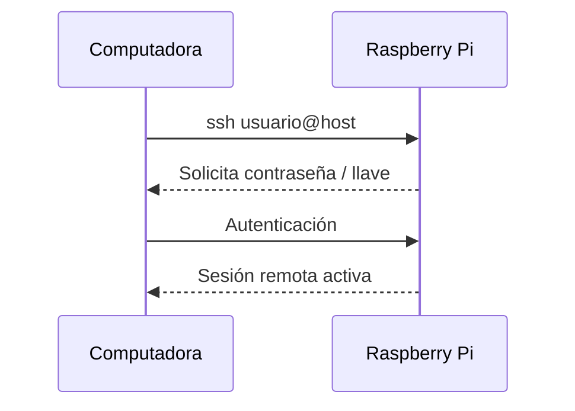
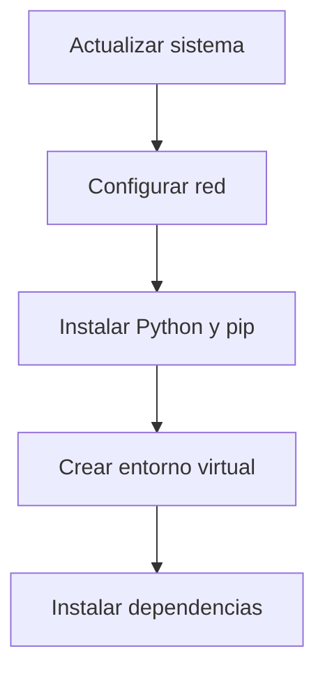

# Acceso Remoto y Fundamentos de Linux en Raspberry Pi

> Clase 01 · Enfoque: Raspberry Pi, acceso remoto y base de Linux para proyectos futuros.

## Tabla de Contenidos

- [Alcances y Objetivos](#alcances-y-objetivos)
- [Mapa de la Clase](#mapa-de-la-clase)
- [Contenido](#contenido)
- [Requisitos](#requisitos)
- [Herramientas Recomendadas](#herramientas-recomendadas)
- [Acceso Remoto](#acceso-remoto)
- [Fundamentos de Linux](#fundamentos-de-linux)
- [Configuración de la Raspberry Pi](#configuración-de-la-raspberry-pi)
- [Configuración clave ssh de github](#configuración-clave-ssh-de-github)
- [Problemas Comunes y Soluciones](#problemas-comunes-y-soluciones)

## Alcances y Objetivos

En esta clase, se abordarán los siguientes temas:

- Acceso remoto a la Raspberry Pi utilizando SSH.
- Fundamentos de Linux, incluyendo comandos básicos y gestión de archivos.
- Configuración y uso de la Raspberry Pi para proyectos futuros.
- Instalación de Herramientas de Desarrollo y Configuración del Entorno.

### Resultados de Aprendizaje

Al finalizar, podrás:

- Conectarte por SSH a tu Raspberry Pi de forma segura.
- Ejecutar y comprender comandos básicos de Linux.
- Actualizar el sistema y preparar un entorno de desarrollo en Python.
- Configurar Git y la clave SSH de GitHub para trabajar con repositorios.

## Mapa de la Clase


## Contenido

1. **Acceso Remoto con SSH**
   - Configuración de SSH en la Raspberry Pi.
   - Conexión desde una computadora remota utilizando un cliente SSH.
   - Seguridad y mejores prácticas para el acceso remoto.
2. **Fundamentos de Linux**
   - Navegación por el sistema de archivos.
   - Comandos básicos de Linux (ls, cd, mkdir, rm, etc.).
   - Gestión de usuarios y permisos.
3. **Configuración de la Raspberry Pi**
   - Configuración inicial de la Raspberry Pi.
   - Actualización y mantenimiento del sistema.
4. **Instalación de Herramientas de Desarrollo**
   - Instalación de Python y bibliotecas necesarias.
   - Configuración de un entorno de desarrollo para proyectos futuros.
   - Introducción a la programación en Python en la Raspberry Pi.

## Requisitos

| Requisito | Descripción |
| --- | --- |
| Raspberry Pi | Con Raspbian OS instalado |
| Conectividad | Acceso a Internet (Wi-Fi o Ethernet) |
| Cliente SSH | PuTTY (Windows), Terminal (macOS/Linux) o VS Code |

## Herramientas Recomendadas

| Herramienta | Uso principal |
| --- | --- |
| Visual Studio Code | Desarrollo remoto |
| Git | Control de versiones |
| Python | Programación |
| Terminal | Comandos de Linux |

## Acceso Remoto

Para acceder a la Raspberry Pi de forma remota, se utilizará SSH (Secure Shell). A continuación, se detallan los pasos para configurar y utilizar SSH:



1. **Habilitar SSH en la Raspberry Pi**
   - Conecta un monitor y teclado a la Raspberry Pi.
   - Abre una terminal y ejecuta el siguiente comando para habilitar SSH:

     ```bash
     sudo raspi-config
     ```

   - Navega a "Interfacing Options" > "SSH" y selecciona "Enable".
2. **Conectar desde una Computadora Remota**
   - Desde tu computadora, abre un terminal o cliente SSH y ejecuta el siguiente comando, reemplazando `pi` con tu nombre de usuario y `raspberrypi.local` con la dirección IP de tu Raspberry Pi:

     ```bash
     ssh pi@raspberrypi.local
     ```

   - Ingresa la contraseña cuando se te solicite (la contraseña predeterminada es "raspberry").
   - Una vez conectado, podrás ejecutar comandos en la Raspberry Pi de forma remota.
   - Recuerda cambiar la contraseña predeterminada por seguridad.
3. **Seguridad y Mejores Prácticas**
   - Cambia la contraseña predeterminada para evitar accesos no autorizados.
   - Considera configurar autenticación basada en claves para mayor seguridad.
   - Mantén tu sistema actualizado para protegerlo contra vulnerabilidades.

## Fundamentos de Linux

En esta sección, se cubrirán los comandos básicos de Linux y la gestión de archivos en la Raspberry Pi. Algunos comandos esenciales incluyen:

| Comando | Descripción |
| --- | --- |
| `ls` | Lista archivos y directorios en el directorio actual |
| `cd` | Cambia el directorio actual |
| `mkdir` | Crea un nuevo directorio |
| `rm` | Elimina archivos o directorios |
| `chmod` | Cambia permisos de archivos o directorios |
| `chown` | Cambia el propietario de archivos o directorios |

### Gestión de Paquetes

Para instalar software en la Raspberry Pi, se utiliza el sistema de gestión de paquetes `apt`. Algunos comandos útiles incluyen:

| Comando | Uso |
| --- | --- |
| `sudo apt update` | Actualiza la lista de paquetes |
| `sudo apt upgrade` | Actualiza paquetes instalados |
| `sudo apt install <paquete>` | Instala un paquete |
| `sudo apt remove <paquete>` | Elimina un paquete |

## Configuración de la Raspberry Pi

Para configurar la Raspberry Pi, se recomienda realizar los siguientes pasos:



1. **Actualizar el Sistema**
   - Ejecuta los siguientes comandos para asegurarte de que tu sistema esté actualizado:

     ```bash
     sudo apt update
     sudo apt upgrade
     ```

2. **Configurar la Red**
   - Asegúrate de que tu Raspberry Pi esté conectada a la red, ya sea a través de Wi-Fi o Ethernet.
   - Puedes verificar la conexión de red utilizando el comando:

     ```bash
     ifconfig
     ```

3. **Configurar el Entorno de Desarrollo**
   - Instala Python y las bibliotecas necesarias para tus proyectos:

     ```bash
     sudo apt install python3 python3-pip
     ```

   - Configura un entorno de desarrollo utilizando Visual Studio Code o cualquier otro editor de tu preferencia.
   - Considera utilizar entornos virtuales para gestionar las dependencias de tus proyectos de Python.
   - Para crear un entorno virtual, puedes usar el siguiente comando:

     ```bash
     python3 -m venv myenv
     source myenv/bin/activate
     ```

   - Instala las bibliotecas necesarias dentro del entorno virtual utilizando `pip`:

    ```bash
    pip install <nombre_de_la_biblioteca>
    ```

   - Recuerda desactivar el entorno virtual cuando hayas terminado:

      ```bash
        deactivate
      ```

   - Esto te permitirá mantener tus proyectos organizados y evitar conflictos de dependencias entre diferentes proyectos.
   - Tener una lista de dependencias en un archivo `requirements.txt` también es una buena práctica para facilitar la instalación de las mismas en otros entornos o para compartir tu proyecto con otros desarrolladores.
   - Puedes crear un archivo `requirements.txt` con las dependencias de tu proyecto utilizando el siguiente comando:

      ```bash
      pip freeze > requirements.txt
      ```

   - Luego, otros desarrolladores pueden instalar las mismas dependencias utilizando el comando:

      ```bash
      pip install -r requirements.txt
      ```

## Configuración clave ssh de github

Para configurar la clave SSH de GitHub en tu Raspberry Pi, sigue estos pasos:

1. **Configurar Nombre de Usuario y Correo Electrónico en Git**
   - Abre una terminal y ejecuta los siguientes comandos para configurar tu nombre de usuario y correo electrónico en Git:

     ```bash
     git config --global user.name "Tu Nombre"
     git config --global user.email "tu.correo@ejemplo.com"
     ```

2. **Generar una Clave SSH**
   - Ejecuta el siguiente comando para generar una nueva clave SSH:

        ```bash
        ssh-keygen -t rsa -C "Tu Email"
        ```

   - Presiona Enter para aceptar la ubicación predeterminada del archivo y luego ingresa una contraseña segura cuando se te solicite.
   - Esto generará dos archivos: `id_rsa` (clave privada) y `id_rsa.pub` (clave pública).
3. **Agregar la Clave SSH a GitHub**
   - Abre el archivo `id_rsa.pub` con un editor de texto y copia su contenido.
   - Inicia sesión en tu cuenta de GitHub y ve a "Settings" > "SSH and GPG keys".
   - Haz clic en "New SSH key", pega el contenido de tu clave pública en el campo "Key" y asigna un título descriptivo.
   - Haz clic en "Add SSH key" para guardar la clave.
4. **Probar la Conexión SSH**
   - En tu terminal, ejecuta el siguiente comando para probar la conexión SSH con GitHub:

        ```bash
        ssh -T git@github.com
        ```

   - Si todo está configurado correctamente, deberías ver un mensaje de bienvenida de GitHub indicando que la autenticación fue exitosa.

### Checklist Rápido

- [ ] SSH habilitado en la Raspberry Pi
- [ ] Conexión remota funcional (`ssh usuario@host`)
- [ ] Sistema actualizado (`apt update/upgrade`)
- [ ] Python y pip instalados
- [ ] Entorno virtual configurado
- [ ] Git configurado con usuario y correo
- [ ] Clave SSH agregada en GitHub

## Problemas Comunes y Soluciones
- **No se puede conectar a la Raspberry Pi a través de SSH**
  - Asegúrate de que SSH esté habilitado en la Raspberry Pi.
  - Verifica que la Raspberry Pi esté conectada a la red y que estés utilizando la dirección IP correcta.
  - Asegúrate de que el firewall no esté bloqueando las conexiones SSH.
- **Permisos denegados al intentar acceder a la Raspberry Pi**
  - Verifica que estás utilizando el nombre de usuario correcto.
  - Asegúrate de que la contraseña sea correcta.
  - Si estás utilizando autenticación basada en claves, asegúrate de que la clave privada esté en el lugar correcto y tenga los permisos adecuados.
- **Problemas al instalar paquetes con apt**
  - Asegúrate de que tu sistema esté actualizado ejecutando `sudo apt update`.
  - Verifica que tienes suficiente espacio en disco para instalar nuevos paquetes.
- **Problemas al configurar el entorno de desarrollo**
  - Asegúrate de que Python esté instalado correctamente.
  - Verifica que las bibliotecas necesarias estén instaladas en tu entorno virtual.
- **Problemas al configurar la clave SSH de GitHub**
  - Asegúrate de que la clave SSH se haya generado correctamente y que el contenido de la clave pública se haya copiado correctamente a GitHub.
  - Verifica que estás utilizando la clave SSH correcta al intentar conectarte a GitHub.
  - Asegúrate de que tu cuenta de GitHub esté configurada para aceptar conexiones SSH.
