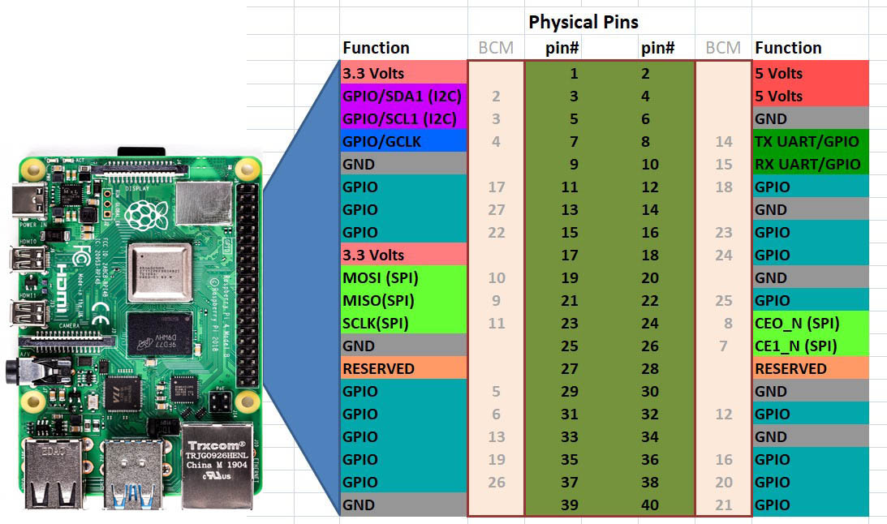

# GPIOs y Sensores - Introducción (Raspberry Pi)

> Documento de apoyo para Clase 1. La biblioteca principal recomendada es **RPi.GPIO**.

## Tabla de Contenidos

- [GPIOs y Sensores - Introducción (Raspberry Pi)](#gpios-y-sensores---introducción-raspberry-pi)
  - [Tabla de Contenidos](#tabla-de-contenidos)
  - [1. Concepto de GPIO](#1-concepto-de-gpio)
    - [Características típicas en Raspberry Pi](#características-típicas-en-raspberry-pi)
  - [2. Seguridad eléctrica básica](#2-seguridad-eléctrica-básica)
  - [3. Numeración de pines (BCM vs BOARD)](#3-numeración-de-pines-bcm-vs-board)
  - [4. Modos de GPIO (INPUT/OUTPUT, Pull-up/Pull-down, PWM)](#4-modos-de-gpio-inputoutput-pull-uppull-down-pwm)
    - [4.1 Entrada (INPUT)](#41-entrada-input)
    - [4.2 Salida (OUTPUT)](#42-salida-output)
    - [4.3 Pull-up / Pull-down](#43-pull-up--pull-down)
    - [4.4 PWM (modulación por ancho de pulso)](#44-pwm-modulación-por-ancho-de-pulso)
  - [5. Diagrama de pines](#5-diagrama-de-pines)
  - [6. RPi.GPIO (principal)](#6-rpigpio-principal)
    - [6.1 Instalación](#61-instalación)
    - [6.2 Configuración inicial](#62-configuración-inicial)
    - [6.3 Operaciones básicas](#63-operaciones-básicas)
    - [6.4 Limpieza final (obligatoria)](#64-limpieza-final-obligatoria)
  - [7. gpiozero (mención y diferencias)](#7-gpiozero-mención-y-diferencias)
  - [8. Comparación rápida RPi.GPIO vs gpiozero](#8-comparación-rápida-rpigpio-vs-gpiozero)
  - [9. Sensor DHT11/DHT22 (lectura digital)](#9-sensor-dht11dht22-lectura-digital)
    - [9.1 Comparativa rápida](#91-comparativa-rápida)
    - [9.2 Conexión física](#92-conexión-física)
    - [9.3 Librerías recomendadas (con RPi.GPIO)](#93-librerías-recomendadas-con-rpigpio)
    - [9.4 Código de ejemplo](#94-código-de-ejemplo)
  - [10. Buenas prácticas](#10-buenas-prácticas)
  - [11. Recursos adicionales](#11-recursos-adicionales)

---

## 1. Concepto de GPIO

**GPIO** (General Purpose Input/Output) son pines programables que permiten a la Raspberry Pi interactuar con el mundo físico:

- **Entrada**: leer señales de sensores o botones.
- **Salida**: activar LEDs, relays, motores, buzzer, etc.

### Características típicas en Raspberry Pi

- **40 pines** (modelos recientes).
- **Nivel lógico**: 3.3V (**no** 5V directamente).
- **Corriente recomendada**: hasta 16mA por pin (máximo total ~50mA).
- **Protocolos soportados**: I2C, SPI, UART (además de GPIO básico).

---

## 2. Seguridad eléctrica básica

- **Nunca apliques 5V** directo a un GPIO (puedes dañar la placa).
- Usa **resistencias** con LEDs y sensores (ej. 220Ω–1kΩ según el circuito).
- Para relays o motores, utiliza **driver/etapa de potencia** (transistor o módulo).
- Si no estás seguro, verifica el **pinout** antes de conectar.

---

## 3. Numeración de pines (BCM vs BOARD)

Hay dos formas de referirse a los pines:

- **BCM**: número del GPIO interno (recomendado para documentación técnica).
- **BOARD**: número físico del pin en el conector.

**Recomendación**: usa **BCM** en tus proyectos para evitar confusiones al cambiar de hardware.

> **Espacio para imagen**: diagrama comparativo BCM vs BOARD
>
> 
>
> <!-- FOTO: comparación de numeración BCM/BOARD -->
---

## 4. Modos de GPIO (INPUT/OUTPUT, Pull-up/Pull-down, PWM)

### 4.1 Entrada (INPUT)

- El pin se usa para **leer** niveles lógicos (HIGH/LOW).
- Es común usar **resistencias pull-up o pull-down** para evitar estados flotantes.

```python
GPIO.setup(17, GPIO.IN, pull_up_down=GPIO.PUD_UP)
```

### 4.2 Salida (OUTPUT)

- El pin entrega un nivel lógico **HIGH (3.3V)** o **LOW (0V)**.

```python
GPIO.setup(18, GPIO.OUT)
GPIO.output(18, GPIO.HIGH)
```

### 4.3 Pull-up / Pull-down

- **Pull-up**: por defecto lee HIGH, y cambia a LOW cuando el botón conecta a GND.
- **Pull-down**: por defecto lee LOW, y cambia a HIGH cuando el botón conecta a 3.3V.

```python
GPIO.setup(17, GPIO.IN, pull_up_down=GPIO.PUD_DOWN)
```

### 4.4 PWM (modulación por ancho de pulso)

- Permite “simular” control analógico variando el ciclo de trabajo (duty cycle).
- Útil para **brillo de LEDs** o **velocidad de motores**.

```python
GPIO.setup(18, GPIO.OUT)
pwm = GPIO.PWM(18, 1000)  # 1000 Hz
pwm.start(50)             # 50% de duty
pwm.ChangeDutyCycle(80)
```

---

## 5. Diagrama de pines

> **Espacio para imagen**: pinout de Raspberry Pi
>
> 
>
> <!-- FOTO: pinout de Raspberry Pi con GPIO destacados -->

---

## 6. RPi.GPIO (principal)

### 6.1 Instalación

```bash
pip3 install RPi.GPIO
```

> En Raspberry Pi OS suele venir preinstalado, pero se recomienda actualizar si es necesario.

### 6.2 Configuración inicial

```python
import RPi.GPIO as GPIO

GPIO.setmode(GPIO.BCM)    # Recomendado: numeración BCM
GPIO.setwarnings(False)   # Opcional: desactiva advertencias
```

### 6.3 Operaciones básicas

```python
# Salida
GPIO.setup(18, GPIO.OUT)
GPIO.output(18, GPIO.HIGH)
GPIO.output(18, GPIO.LOW)

# Entrada con pull-up
GPIO.setup(17, GPIO.IN, pull_up_down=GPIO.PUD_UP)
if GPIO.input(17) == GPIO.LOW:
    print("Botón presionado")
```

### 6.4 Limpieza final (obligatoria)

```python
GPIO.cleanup()
```

> **Importante**: Siempre llama a `GPIO.cleanup()` para liberar recursos y evitar conflictos en ejecuciones futuras.

---

## 7. gpiozero (mención y diferencias)

`gpiozero` es una biblioteca más amigable que abstrae componentes comunes (LED, Button, Motor). Se menciona para que conozcas su existencia, pero **la guía principal de la clase usa RPi.GPIO**.

Ventajas de `gpiozero`:

- Sintaxis más corta y legible.
- Manejo automático de limpieza (no requiere `cleanup()` explícito).
- Ideal para prototipos rápidos y educación.

Limitaciones frente a RPi.GPIO:

- Menos control fino sobre configuración de bajo nivel.
- Abstracciones que pueden ocultar detalles eléctricos importantes.

---

## 8. Comparación rápida RPi.GPIO vs gpiozero

| Aspecto | RPi.GPIO (principal) | gpiozero (mención) |
| --- | --- | --- |
| Nivel de control | Bajo nivel, detallado | Alto nivel, abstracto |
| Configuración | Manual | Automática por componente |
| PWM | Manual | Integrado |
| Limpieza | Requiere `cleanup()` | Automática |
| Curva de aprendizaje | Media | Baja |
| Casos ideales | Proyectos avanzados, control preciso | Educación, prototipos rápidos |

---

## 9. Sensor DHT11/DHT22 (lectura digital)

### 9.1 Comparativa rápida

| Parámetro | DHT11 | DHT22 |
| --- | --- | --- |
| Rango Temp | 0–50°C (±2°C) | -40–80°C (±0.5°C) |
| Rango Humedad | 20–80% (±5%) | 0–100% (±2%) |
| Frecuencia | 1 Hz | 0.5 Hz |
| Consumo | 0.5–2.5mA | 1–1.5mA |
| Precio | Bajo | Moderado |

### 9.2 Conexión física

```
VCC  -> 3.3V
DATA -> GPIO4 (Pin 7)
NC   -> No conectar
GND  -> GND
```

> **Nota**: Usa resistencia pull-up de **4.7kΩ** entre VCC y DATA.

> **Espacio para imagen**: diagrama de cableado DHT
>
> 
>
> <!-- FOTO: cableado DHT con GPIO4 -->

### 9.3 Librerías recomendadas (con RPi.GPIO)

```bash
pip3 install adafruit-circuitpython-dht
sudo apt-get install libgpiod2
```

### 9.4 Código de ejemplo

```python
import time
import board
import adafruit_dht

sensor = adafruit_dht.DHT11(board.D4)  # GPIO4

while True:
    try:
        temp_c = sensor.temperature
        hum = sensor.humidity
        print(f"Temp: {temp_c:.1f} C | Humedad: {hum:.1f}%")
    except RuntimeError as e:
        print(f"Lectura fallida: {e.args[0]}")
    time.sleep(2.0)
```

---

## 10. Buenas prácticas

- Verifica el **pinout** antes de conectar.
- Usa **pull-up/pull-down** para evitar lecturas inestables.
- No mezcles bibliotecas en el mismo programa para los mismos pines.
- Añade **delay** adecuado en sensores lentos (DHT22 necesita ≥2s).
- Documenta el cableado con fotos o diagramas.

---

## 11. Recursos adicionales

- Documentación gpiozero
- Documentación RPi.GPIO
- Tutoriales de Raspberry Pi

> Si necesitas, puedo agregar enlaces oficiales exactos en esta sección.
