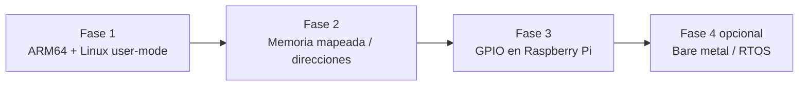

# Laboratorio de Programación en Ensamblador ARM64 (AArch64) en Linux

Última revisión: 2025-03-17

## 1. Introducción / Propósito

Proyecto académico para ejecutar y depurar programas en ensamblador ARM64 **principalmente en Raspberry Pi (ARM64)** con Linux. Se estudian:

- Ensamblador ARM64 (GAS)
- ABI AArch64
- Syscalls Linux
- Stack, registros y memoria

Cuando no haya hardware ARM, se trabaja con QEMU en host x86 sin cambiar las fuentes. Futuras fases incorporarán acceso a memoria mapeada, GPIO en Raspberry Pi e interacción directa con hardware.

## 2. Alcance actual

- ARM64 user-mode sobre Linux-
- Ensamblador GNU (GAS)
- Syscalls Linux
- Análisis de ejecución a bajo nivel
- No bare-metal
- No acceso directo a GPIO
- No RTOS / microcontroladores
  El acceso a hardware (GPIO/MMIO) se abordará en fases posteriores.

## 3. ¿Qué leer primero? (según rol)

| Rol        | Lecturas sugeridas                                         | Tiempo estimado |
| ---------- | ---------------------------------------------------------- | --------------- |
| Estudiante | README (secciones 1–8), `docs/debugging-aarch64-vscode.md` | 20–30 min       |
| Instructor | README completo, `docs/makefiles-arm64-variants.md`, guías | 30–40 min       |

## 4. Estructura del repositorio

- `lessons/`: prácticas progresivas. Las primeras son de arquitectura; futuras podrán incluir interacción con hardware.
- `docs/`: guías (depuración VS Code, Makefiles, variantes ARM64).
- `.vscode/`: configuración de depuración.
- `tools/`: utilidades varias.

## 5. Organización de las lecciones

- Lecciones iniciales sin privilegios especiales; el código corre como proceso de usuario.
- Misma estructura de comandos (`make`, `make run`, `make gdb`, `make clean`) en todas las lecciones para seguridad y portabilidad.
- Cada lección debe declarar objetivos de aprendizaje, conceptos cubiertos y un breve checklist de verificación.

## 6. Plataformas soportadas

| Flujo           | Ejecución                 | Depuración                          | Toolchain                              |
| --------------- | ------------------------- | ----------------------------------- | -------------------------------------- |
| Raspberry Pi    | Nativa (`./build/main`)   | `gdb` local o VS Code remoto SSH    | `as`, `ld`, `gdb`                      |
| Host x86 + QEMU | `qemu-aarch64 build/main` | GDB stub `localhost:1234` + VS Code | `aarch64-linux-gnu-*`, `gdb-multiarch` |

- El uso de QEMU no altera los conceptos estudiados.

## 7. Requisitos del sistema

### Generales

- Linux
- Visual Studio Code + extensión **C/C++**

### Raspberry Pi (ARM64)

- OS Linux ARM64
- `binutils` (as/ld)
- `gdb`

### Host x86

- `qemu-aarch64`
- `gdb-multiarch`
- Toolchain cruzado `aarch64-linux-gnu-*`

## 8. Compilación y ejecución (visión general)

Las mismas fuentes se ejecutan sin modificación tanto en Raspberry Pi como en QEMU.

- `make` (o `make all`): ensambla y enlaza con símbolos de depuración.
- `make run`: ejecuta el binario (nativo en Pi, emulado en x86).
- `make gdb`: depuración (local en Pi, GDB stub vía QEMU en x86).
- `make clean`: limpia `build/`.
- `make info`: muestra ayuda rápida.
    Detalles ampliados en `docs/makefiles-arm64-variants.md`.

## 9. Depuración con VS Code

- Raspberry Pi: depuración local o remota (SSH) usando `cppdbg`.
- QEMU: stub GDB (`localhost:1234`) levantado por `make gdb`.
- Pasos completos en `docs/debugging-aarch64-vscode.md`.

## 10. Progresión futura del laboratorio

## 11. Documentación técnica

- [Depuración VS Code](docs/debugging-aarch64-vscode.md)
- [Makefiles y variantes (QEMU y nativo)](docs/makefiles-arm64-variants.md)
- GPIO / MMIO: futuro (aún no incluido)

## 12. Lecciones disponibles

- `lessons/00_hello_world`: arquitectura básica, flujo mínimo.
- `lessons/99_test`: flujo multi-fuente, pruebas y modularidad.
- Futuras lecciones: se irán agregando (mixtas / hardware directo).

## 13. Notas pedagógicas

El laboratorio comienza en modo usuario para asegurar comprensión de la arquitectura antes de interactuar con hardware. La alternativa QEMU permite practicar sin hardware físico; en Raspberry Pi el mismo código corre nativamente.
