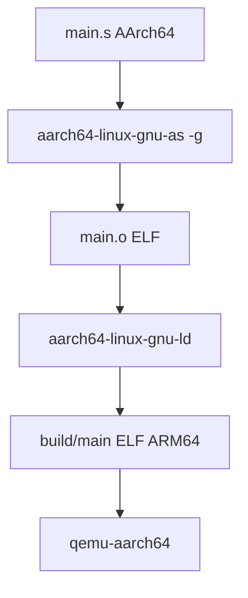
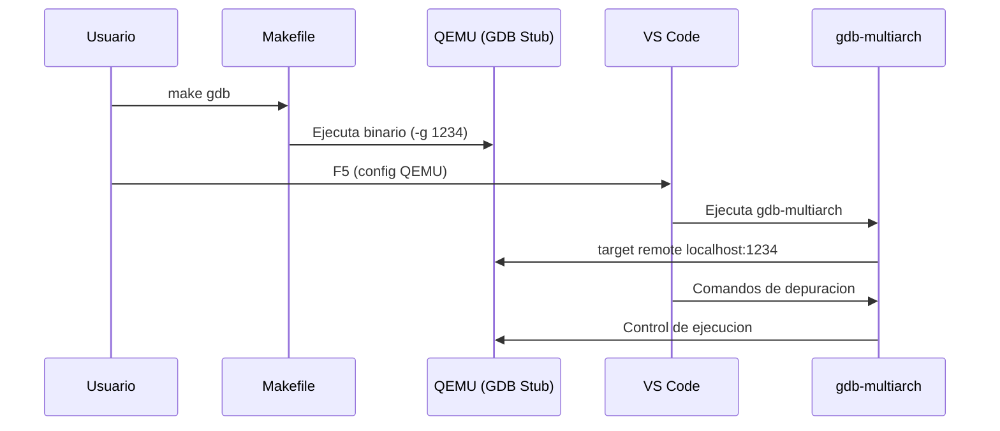

# Depuración ARM64 (AArch64) con VS Code: entornos nativo ARM y host x86 y x64 + QEMU

Última revisión: 2025-03-17

## Qué cubre esta guía

- Depuración de binarios ARM64 en Linux escritos en ensamblador (syscalls directas, sin libc).
- Un mismo código y Makefiles, dos formas de ejecutarlo:
  - Host ARM64 (Raspberry Pi u otro equipo ARM64): ejecución y GDB nativos, sin QEMU.
  - Host x86 y x64: emulación con QEMU user-mode y depuración remota con gdb-multiarch.
- Cada sección indica qué instalar, qué comandos usar y cómo adaptar `launch.json` según la arquitectura.

## Decide tu flujo (elige solo uno)

- ¿Tu máquina es ARM64 (Pi 4/5, portátil ARM64, VM ARM)? -> usa **Sección 2 (nativo ARM)**.
- ¿Tu máquina es x86 y x64 y no tienes ARM64? -> usa **Sección 3 (QEMU en x86 y x64)**.

## 1. Requisitos comunes (ambos flujos)

- OS: Linux.
- VS Code.
- Extensiones: C/C++, Assembly for ARM64, MemoryView.
- Ajuste recomendado: `debug.allowBreakpointsEverywhere: true` (ya está en `.vscode/settings.json`).
- Estructura base:

```text
project-root/
├── lessons/00_hello_world/
│   ├── main.s
│   ├── Makefile
│   └── build/
├── .vscode/launch.json
└── docs/debugging-aarch64-vscode.md
```

### Makefiles listos para copiar (según tu host)

- Host x86 y x64 + QEMU: copia `tools/makefile-templates/Makefile.qemu.single` (1 fuente) o `Makefile.qemu.multi` (multi-fuente).
- Host ARM64 nativo: copia `tools/makefile-templates/Makefile.arm64.single` (1 fuente) o `Makefile.arm64.multi` (multi-fuente).
- Guía extendida y comparativa en `docs/makefiles-arm64-variants.md`.

## 2. Si tu host es ARM64 (nativo, sin QEMU)

### 2.1 Instala lo necesario en ARM64

```bash
sudo apt update
sudo apt install -y binutils gdb gdbserver
```

- No instales ni uses QEMU para este flujo.

### 2.2 Compila y ejecuta en ARM64

- Con los Makefiles nativos (copia `Makefile.arm64.*` en la lección):

```bash
cd lessons/<leccion>
make          # build
make run      # ejecuta directo en ARM64 (sin QEMU)
make gdb      # abre gdb local sobre build/main
```

- Manual sin Makefile (host ARM64):

```bash
cd lessons/<leccion>
mkdir -p build
as -g -o build/main.o main.s             # o aarch64-linux-gnu-as
ld -o build/main build/main.o            # o aarch64-linux-gnu-ld
./build/main
```

- Los targets `make run`/`make gdb` de las plantillas QEMU son solo para x86 y x64; en ARM64 usa las plantillas nativas o ejecuta manualmente.

### 2.3 Depuración local en ARM64

```bash
gdb ./build/main
```

- Configuración `launch.json` recomendada (local ARM64):

```json
{
    "name": "Debug ARM64 (nativo)",
    "type": "cppdbg",
    "request": "launch",
    "program": "${workspaceFolder}/lessons/${input:lesson}/build/main",
    "cwd": "${workspaceFolder}/lessons/${input:lesson}",
    "MIMode": "gdb",
    "miDebuggerPath": "/usr/bin/gdb",
    "stopAtEntry": true,
    "setupCommands": [
        { "text": "-enable-pretty-printing" },
        { "text": "set architecture aarch64" }
    ]
}
```

### 2.4 Checklist nativo ARM

- `build/main` generado con `AS=as LD=ld` (o prefijo ARM64).
- Se ejecuta con `./build/main` (sin QEMU).
- GDB muestra registros ARM64 (`info registers`).

## 3. Si tu host es x86 y x64 (usa QEMU user-mode)

### 3.1 Instala lo necesario en x86 y x64

```bash
sudo apt update
sudo apt install -y binutils-aarch64-linux-gnu qemu-user gdb-multiarch build-essential
```

- Necesitas QEMU para ejecutar y un stub GDB para depurar.

### 3.2 Compila y ejecuta en x86 y x64 con QEMU

```bash
cd lessons/<leccion>
make                 # usa aarch64-linux-gnu-as/ld y genera build/main
make run             # ejecuta en QEMU user-mode (sin depurar)
make gdb             # QEMU en pausa, stub GDB en localhost:1234 (deja esta terminal abierta)
```

- Opción mínima sin Makefile:

```bash
cd lessons/<leccion>
mkdir -p build
aarch64-linux-gnu-as -g -o build/main.o main.s
aarch64-linux-gnu-ld -o build/main build/main.o
qemu-aarch64 build/main                 # ejecución
qemu-aarch64 -g 1234 build/main         # depuración (stub GDB)
```

- Se recomienda usar los targets `make run`/`make gdb` de las plantillas QEMU para no duplicar comandos.

### 3.3 Depuración en x86 y x64 con VS Code + gdb-multiarch

- Configuración `launch.json` para este flujo:

```json
{
    "name": "Debug ARM64 (QEMU)",
    "type": "cppdbg",
    "request": "launch",
    "program": "${workspaceFolder}/lessons/${input:lesson}/build/main",
    "cwd": "${workspaceFolder}/lessons/${input:lesson}",
    "MIMode": "gdb",
    "miDebuggerPath": "/usr/bin/gdb-multiarch",
    "miDebuggerServerAddress": "localhost:1234",
    "stopAtEntry": true,
    "sourceFileMap": {
        "${workspaceFolder}/lessons/${input:lesson}": "${workspaceFolder}/lessons/${input:lesson}"
    },
    "setupCommands": [
        { "text": "-enable-pretty-printing" },
        { "text": "set architecture aarch64" },
        { "text": "set breakpoint auto-hw on" }
    ]
}
```

- Flujo: `make gdb` -> F5 con esta configuración -> selecciona la lección.

### 3.4 Diagramas QEMU (referencia)





### 3.5 Checklist x86 y x64 + QEMU

- `build/main` existe con símbolos (`-g`).
- `make gdb` sigue ejecutándose y QEMU escucha en `localhost:1234`.
- VS Code conecta y los breakpoints en `.s` se activan.
- MemoryView muestra memoria con la ejecución detenida.

### 3.6 Errores comunes (x86 y x64)

- Puerto 1234 ocupado o QEMU cerrado: relanza `make gdb`.
- Breakpoints sin efecto: revisa `debug.allowBreakpointsEverywhere` y `sourceFileMap`.
- MemoryView falla: reduce tamaño o usa direcciones válidas (pila, datos).

## 4. Extensiones y ajustes de VS Code (ambos flujos)

- C/C++ (Microsoft): habilita `cppdbg`.
- Assembly for ARM64: resaltado de sintaxis.
- MemoryView: visualiza memoria con la ejecución detenida.
- Ajuste: `debug.allowBreakpointsEverywhere` para permitir breakpoints en `.s`.

## 5. Resumen operativo por rol

- Si tienes ARM64 disponible: compila con `AS=as LD=ld`, ejecuta `./build/main`, depura con `gdb` (o `gdbserver` + `miDebuggerServerAddress`), usa `launch.json` sin `miDebuggerServerAddress` para modo local.
- Si estás en x86 y x64 sin ARM64: compila con el toolchain cruzado, ejecuta/depura vía `qemu-aarch64`; usa `gdb-multiarch` y la configuración QEMU con `miDebuggerServerAddress`.

## 6. Observaciones finales

- El código fuente es único; cambian solo las herramientas de ejecución/depuración según el host.
- No mezcles comandos: `make run/gdb` es solo para x86 y x64+QEMU; en ARM64 usa ejecución y GDB nativos.
- Mantén sincronizados binarios y rutas cuando uses gdbserver o conexiones remotas.
