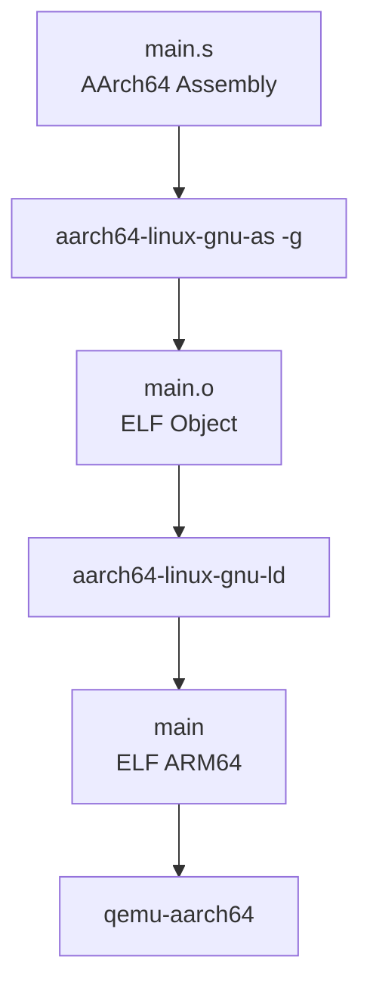
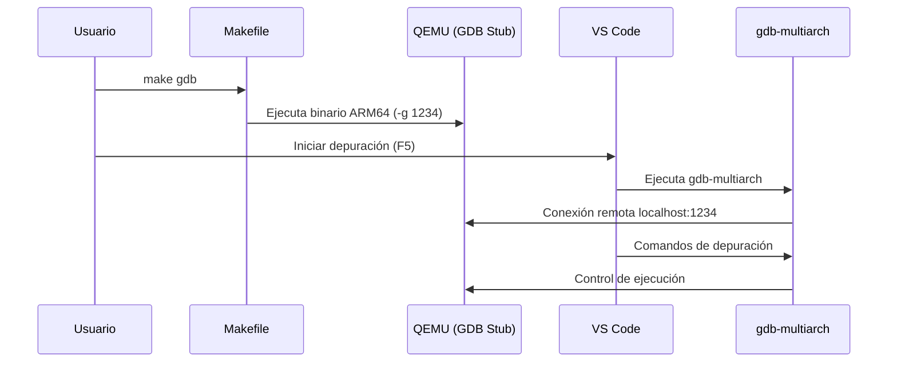
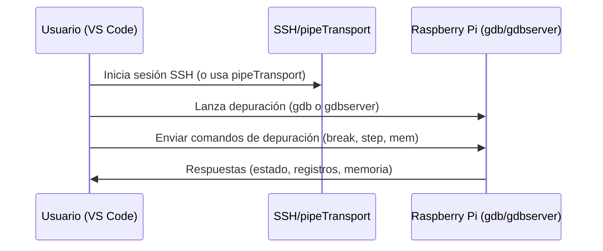

# Depuración de programas AArch64 (ARM64) en host x86 mediante QEMU y Visual Studio Code
Última revisión: 2025-03-17

## Objetivos de la guía

- Configurar depuración con VS Code para dos escenarios: Raspberry Pi (ARM64) y host x86 con QEMU.
- Reutilizar las mismas fuentes y Makefiles sin cambios.
- Practicar inspección de registros, memoria y breakpoints en ensamblador.

## Resumen rápido de flujos de depuración

| Escenario          | Ejecución                 | Conexión GDB                     | Uso típico en VS Code          |
|--------------------|---------------------------|----------------------------------|--------------------------------|
| Raspberry Pi local | `./build/main`            | `gdb build/main`                 | `cppdbg` local (`program`, `cwd`) |
| Raspberry Pi por SSH| `./build/main` vía SSH    | `gdb` remoto (`gdbserver` opcional) | `cppdbg` con `pipeTransport` (SSH) |
| Host x86 + QEMU    | `qemu-aarch64 -g 1234 …`  | Stub GDB `localhost:1234`        | `cppdbg` con `miDebuggerServerAddress` |

## 1. Objetivo

Configurar un entorno **reproducible y académico** para la **construcción, ejecución y depuración** de programas AArch64 (ARM64) escritos en ensamblador, usando un **host x86 con Linux**, **QEMU en modo usuario** y **depuración remota con GDB integrada en Visual Studio Code**. El flujo soporta múltiples lecciones, cada una con su propio Makefile y binario.

---

## 2. Alcance

- Programas escritos en **ensamblador AArch64**
- Binarios **Linux ARM64** (ELF)
- Ejecución mediante **QEMU user-mode**
- Depuración remota con **GDB multi-arquitectura**
- Interfaz gráfica de depuración mediante **Visual Studio Code**

No se utiliza libc ni funciones de alto nivel; el código interactúa directamente con el kernel Linux mediante **syscalls**.

---

## 3. Requisitos del sistema

### 3.1 Sistema operativo anfitrión

- Linux x86_64 (probado en Debian/Ubuntu)

### 3.2 Herramientas en Linux

Instale las siguientes herramientas en el sistema anfitrión:

- **aarch64-linux-gnu-as**  
  Ensamblador cruzado para la arquitectura AArch64.

- **aarch64-linux-gnu-ld**  
  Enlazador cruzado para generar ejecutables ELF ARM64.

- **qemu-aarch64**  
  Emulador de binarios ARM64 en modo usuario.

- **gdb-multiarch**  
  Depurador GDB con soporte para múltiples arquitecturas, incluyendo AArch64.

#### Instalación típica (Debian/Ubuntu)

```bash
sudo apt update
sudo apt install -y binutils-aarch64-linux-gnu qemu-user gdb-multiarch
```

---

## 4. Herramientas de desarrollo

### 4.1 Visual Studio Code

Visual Studio Code se utiliza como entorno de desarrollo y **frontend gráfico del depurador**.

### 4.2 Extensiones de VS Code

- **C/C++ (Microsoft):** habilita el depurador `cppdbg` para actuar como cliente GDB remoto.
- **Assembly for ARM64:** resaltado y ayudas básicas para archivos `.s` de AArch64.
- **MemoryView:** panel de memoria durante la depuración.

---

## 5. Estructura del proyecto (ejemplo)

```text
project-root/
├── lessons/
│   ├── 00_hello_world/
│   │   ├── main.s
│   │   ├── Makefile            # flujo mínimo (un solo fuente)
│   │   └── build/
│   └── 99_test/
│       ├── main.s
│       ├── add.s
│       ├── Makefile            # flujo multi-fuente
│       └── build/
├── .vscode/
│   └── launch.json
└── docs/
    └── debugging-aarch64-vscode.md
```

---

## 6. Proceso de construcción (resumen)

1. Ensamblado de los `.s` a objetos ELF (`.o`) con símbolos de depuración (`-g`).
2. Enlazado de los objetos para generar un ejecutable ELF ARM64 (`build/main`).
3. Los dos Makefiles mantienen esta secuencia; difieren en el alcance de fuentes y automatización (ver sección 7).

---

## 7. Makefiles disponibles

### 7.1 `lessons/00_hello_world/Makefile`

- **Propósito:** flujo mínimo para la lección de arranque; asume un único archivo `main.s`.
- **Flujo:** ensambla `main.s` → `build/main.o`, enlaza a `build/main`; comandos explícitos y fáciles de seguir.
- **Pros:** ideal para explicar el pipeline básico; Makefile corto y legible; menos sorpresas.
- **Contras:** no maneja múltiples fuentes; si agregas otro `.s` debes editar reglas a mano.
- **Comandos clave:** `make`, `make run`, `make gdb`, `make clean`, `make info`.

### 7.2 `lessons/99_test/Makefile`

- **Propósito:** laboratorio más flexible; compila **todos** los `.s` del directorio (requiere que el punto de entrada sea `main.s`).
- **Flujo:** detecta automáticamente fuentes auxiliares (`wildcard`), genera objetos en `build/` y enlaza a `build/main`.
- **Pros:** permite modularizar ejercicios en varios archivos sin tocar el Makefile; mantiene mismos comandos que la lección 00.
- **Contras:** compila todos los `.s` del directorio (no hay selección parcial); depende de que `main.s` exista y defina `_start`.
- **Comandos clave:** `make`, `make run`, `make gdb`, `make clean`, `make info`.

Use la lección que necesite (00 para el flujo más sencillo, 99 para experimentos multi-fuente) y ejecute los comandos **desde la carpeta de la lección**.

---

## 8. Ejecución mediante QEMU

El ejecutable ARM64 se ejecuta en un host x86 con **QEMU en modo usuario**:

- QEMU traduce dinámicamente instrucciones AArch64 a x86_64.
- No se emula un sistema completo, solo el proceso de usuario.

---

## 9. Depuración remota con QEMU y GDB

### 9.1 GDB stub de QEMU

QEMU puede iniciarse en modo depuración exponiendo un **servidor GDB remoto**:

```bash
qemu-aarch64 -g 1234 build/main
```

En este modo:
- El programa se inicia pausado.
- QEMU espera una conexión GDB en `localhost:1234`.

### 9.2 Cliente GDB

La depuración se realiza mediante **gdb-multiarch**, el cual:

- Se conecta al servidor GDB de QEMU.
- Entiende la arquitectura AArch64.
- Permite inspeccionar registros, memoria y flujo de ejecución.

En este proyecto, **gdb-multiarch es invocado por Visual Studio Code**, no directamente desde el Makefile.

---

## 10. Integración con Visual Studio Code

El archivo `.vscode/launch.json` define una única configuración `Debug ARM64 (QEMU)` que reutiliza GDB remoto:

```json
{
    "version": "0.2.0",
    "inputs": [
        {
            "id": "lesson",
            "type": "pickString",
            "description": "Seleccione la lección",
            "options": [
                "00_hello_world",
                "99_test"
            ]
        }
    ],
    "configurations": [
        {
            "name": "Debug ARM64 (QEMU)",
            "type": "cppdbg",
            "request": "launch",
            "program": "${workspaceFolder}/lessons/${input:lesson}/build/main",
            "cwd": "${workspaceFolder}/lessons/${input:lesson}",
            "MIMode": "gdb",
            "miDebuggerPath": "/usr/bin/gdb-multiarch",
            "miDebuggerServerAddress": "localhost:1234",
            "stopAtEntry": true,
            "sourceFileMap": {
                "${workspaceFolder}/lessons/${input:lesson}": "${workspaceFolder}/lessons/${input:lesson}"
            },
            "setupCommands": [
                {
                    "text": "-enable-pretty-printing"
                },
                {
                    "text": "set architecture aarch64"
                },
                {
                    "text": "set breakpoint auto-hw on"
                }
            ]
        }
    ]
}
```

- Al presionar **F5**, VS Code pedirá seleccionar la lección (`00_hello_world` o `99_test`); usa la misma lección donde corriste `make gdb`.
- `sourceFileMap` mantiene la correspondencia de rutas dentro de la carpeta de la lección para que los breakpoints en `.s` coincidan con las rutas que ve GDB remoto.
- `set breakpoint auto-hw on` fuerza breakpoints por hardware, útil cuando el código está en páginas de solo lectura.
- GDB se conecta al stub de QEMU en `localhost:1234`, así que la terminal donde ejecutaste `make gdb` debe permanecer abierta.

### 10.1 Ajustes recomendados en VS Code

- **Breakpoints en cualquier archivo:** activa `Debug: Allow Breakpoints Everywhere` (`debug.allowBreakpointsEverywhere: true`) desde `Settings` o `settings.json` para poder fijar breakpoints en archivos `.s`.
- **MemoryView:** la extensión agrega el comando *MemoryView: Toggle Memory View for Debugger* accesible con `F1` durante una sesión de depuración.

### 10.2 Modos de uso en Raspberry Pi

- **Local (Pi):** ejecuta `make gdb` (o `gdb build/main`), usa la misma configuración `cppdbg` pero sin `miDebuggerServerAddress` (depuración directa).
- **Remoto (SSH desde VS Code):** conecta VS Code vía SSH, o usa `pipeTransport` en `launch.json` para tunelar `gdb`/`gdbserver`. El binario sigue siendo `build/main` y no requiere QEMU.

---

## 11. Automatización con Makefile

Ambos Makefiles ofrecen los mismos objetivos:

- `make` : Ensambla y enlaza el programa ARM64.
- `make run` : Ejecuta el binario mediante QEMU.
- `make gdb` : Inicia QEMU en modo depuración (servidor GDB en 1234).
- `make clean` : Limpia `build/`.
- `make info` : Lista los objetivos disponibles.

---

## 12. Flujo general del sistema

### 12.1 Flujo de construcción y ejecución



### 12.2 Flujo de depuración remota



### 12.3 Flujo de depuración remota en Raspberry Pi (SSH + gdbserver opcional)



---

## 13. Procedimiento de uso

1. **Preparar VS Code:** instala las extensiones `C/C++`, `Assembly for ARM64` y `MemoryView`; habilita `Debug: Allow Breakpoints Everywhere` para poder fijar breakpoints en cualquier archivo.
2. **Elegir la lección** y entrar a su carpeta: `cd lessons/<leccion>`.
3. **Compilar** el programa: `make`.
4. **Modo depuración:** `make gdb` (deja la terminal abierta; QEMU queda esperando en `1234`).
5. **Iniciar depuración en VS Code:** Configuración `Debug ARM64 (QEMU)` → selecciona la misma lección cuando lo solicite → pulsa **F5**.
6. **Ver memoria con MemoryView:** con la ejecución **detenida** (breakpoint o paso a paso), presiona `F1` y elige `MemoryView: Toggle Memory View for Debugger`; define dirección y tamaño a observar.
7. Depura con breakpoints, inspección de registros/memoria y paso a paso. Para ejecución directa sin depurar, usa `make run`.

### Checklist de verificación rápida

- El binario se generó en `build/main` con símbolos (`-g`).
- VS Code muestra breakpoints activos en `.s`.
- MemoryView abre y muestra la región esperada.
- En QEMU: el stub escucha en `localhost:1234` y GDB se conecta.
- En Raspberry Pi: `gdb` local o remoto responde a `info registers`.

### Errores comunes y mitigaciones

- QEMU no responde en `1234`: confirma que `make gdb` sigue activo y no hay otro proceso usando el puerto.
- Breakpoints que no se activan: verifica `debug.allowBreakpointsEverywhere` y que las rutas coincidan (`sourceFileMap`).
- Memoria inaccesible en MemoryView: usa direcciones válidas (RAM, pila) y tamaños pequeños al inicio.
- En SSH: latencias altas pueden causar timeouts; reduce el número de paquetes de símbolos o usa `gdbserver` con opciones mínimas.

---

## 14. Observaciones finales

- El entorno separa claramente **construcción**, **emulación** y **depuración**, facilitando el análisis académico.
- Selecciona `00_hello_world` cuando necesites el pipeline más explícito y simple; usa `99_test` para ejercicios con varios archivos fuente sin tocar el Makefile.
- No se requiere hardware ARM físico; todo se ejecuta en un host x86 con QEMU.
